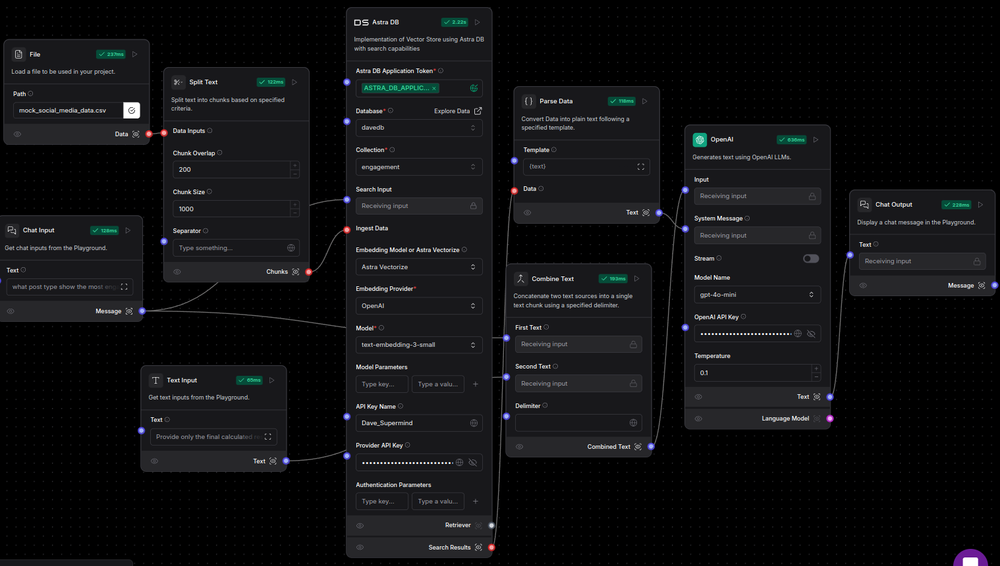

# LangFlow Pipeline Documentation

This document explains each component in the LangFlow pipeline to demonstrate how data flows through the system to generate a meaningful chat output based on user input. The components and their connections are outlined below:

---

## 1. File
- **Purpose**: Loads a CSV file into the system to be used for data processing.
- **Path**: `mock_social_media_data.csv`  
  This file likely contains social media data for further analysis.

- **Output**: Passes the loaded data into the **Split Text** node.

---

## 2. Split Text
- **Purpose**: Splits the input text into smaller chunks for processing, based on specific criteria.
- **Inputs**:
  - **Chunk Overlap**: 200
  - **Chunk Size**: 1000
  - **Separator**: Not specified but could be customized for specific text delimiters.
- **Output**: Produces chunks of text that are easier for downstream components to handle.

---

## 3. Chat Input
- **Purpose**: Takes user input from the playground for processing in the chat system.
- **Text**: Example input: *"What post type shows the most engagement?"*

- **Output**: Sends the user question as a message to downstream nodes.

---

## 4. Astra DB
- **Purpose**: Implements a vector store using Astra DB to enable search capabilities based on embeddings.
- **Configuration**:
  - **Database**: `davedb`
  - **Collection**: `engagement`
  - **Embedding Model**: Astra Vectorize
  - **Embedding Provider**: OpenAI
  - **Model**: `text-embedding-3-small`
  - **API Keys**: Required for authorization.

- **Output**: Returns search results based on the query and embeddings stored in the database.

---

## 5. Parse Data
- **Purpose**: Converts incoming data into plain text following a specified template.
- **Template**: `{text}`  
  This template formats the incoming data.

- **Output**: Generates plain text to be used by downstream components.

---

## 6. OpenAI
- **Purpose**: Generates a response using an OpenAI language model.
- **Inputs**:
  - **Model Name**: `gpt-4o-mini`
  - **Temperature**: 0.1 (Controls the randomness of the output.)
  - **Stream**: Enabled to allow real-time streaming of results.
  - **API Key**: Required for accessing the OpenAI API.
- **Output**: Returns a generated text response based on the input.

---

## 7. Text Input
- **Purpose**: Accepts additional user-defined text input to refine or filter the results.
- **Text**: Example input: *"Provide only the final calculated result."*

- **Output**: Passes refined text for processing.

---

## 8. Combine Text
- **Purpose**: Concatenates two text inputs into a single output, separated by a specified delimiter.
- **Inputs**:
  - **First Text**: Receiving input from previous nodes.
  - **Second Text**: Receiving input from previous nodes.
  - **Delimiter**: Not explicitly defined in this flow.

- **Output**: Produces combined text for further processing.

---

## 9. Chat Output
- **Purpose**: Displays the final chat message in the playground as the system's response to the user's input.
- **Inputs**:
  - **Text**: Receives the processed response from the OpenAI language model.

- **Output**: Displays the response message for the user.

---

## Flow Summary

1. **Input Phase**:
   - User provides a query via **Chat Input**.
   - Relevant social media data is loaded via the **File** node.
   - The data is chunked for easier processing in the **Split Text** node.

2. **Processing Phase**:
   - Data embeddings are retrieved and queried using **Astra DB**.
   - The data is parsed and converted into plain text using the **Parse Data** node.
   - The OpenAI language model generates a response based on the query.

3. **Finalization Phase**:
   - Additional input or adjustments can be made through **Text Input**.
   - Outputs are combined using **Combine Text** for a cohesive response.
   - The final response is displayed using **Chat Output**.

---

## Usage Example
- **User Query**: "What post type shows the most engagement?"
- **System Response**: The flow processes the input, retrieves the relevant insights from the database, generates a response using OpenAI, and outputs the response to the user.

---

If you need further clarification or additional details, feel free to ask!

